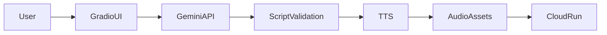

# PepsiCo Audio Marketing Studio

An internal AI-powered platform to generate brand-safe marketing audio content for PepsiCo products.

Project: PepsiCo Audio Marketing Studio
Designed and implemented an AI-powered marketing content platform using Google Gemini and Google Cloud Text-to-Speech to generate brand-safe, broadcast-ready audio advertisements for PepsiCo products. The system enforces product-level brand voice, regulatory-safe messaging, multi-language output, and strict audio duration controls. Deployed on Google Cloud Run with containerized infrastructure, enabling scalable generation of radio, streaming, and in-store audio campaigns.

Key Technologies:
Gemini, Google Cloud Run, Google Text-to-Speech, Python, Gradio, Docker, Generative AI, Brand Governance

## Features
- Gemini-powered marketing storytelling
- Brand-safe prompts per product
- Multi-language support
- Audio duration enforcement
- Broadcast-ready Google TTS voices
- Cloud Run deployable

## Environment Variables
- GOOGLE_API_KEY
- GCP_VI_SERVICE_ACCOUNT_JSON

## Architecture Diagram 



## Deployment (Google Cloud Run)

```bash
gcloud builds submit --tag gcr.io/PROJECT_ID/pepsico-audio-studio
gcloud run deploy pepsico-audio-studio \
  --image gcr.io/PROJECT_ID/pepsico-audio-studio \
  --region us-central1 \
  --platform managed
```


